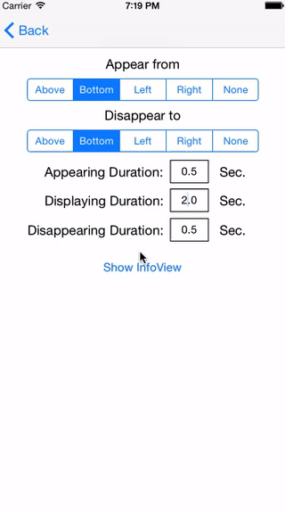

# JTFadingInfoView

[](http://cocoadocs.org/docsets/JTFadingInfoView)
[](http://cocoadocs.org/docsets/JTFadingInfoView)
[](http://cocoadocs.org/docsets/JTFadingInfoView)

## Overview
`JTFadingInfoView` is google's material design like notification view with smooth fade in/out animation features, based on UIButton subclass.

You can select fade in/out direction as you like. Also, customizable properties can be tweaked behaviors and enhance your application UI cool.

With this library, you can easily implement floating in-app notification to your app, such as login success/fail notification messages.
 
 
 
## Installation
JTFadingInfoView is available on CocoaPods.

You can use this library by adding the following command onto your Podfile:

```ruby
pod "JTFadingInfoView"
```

## Usage

The simplest setup: 

```objective-c
  CGRect frame = CGRectMake(150, 200, 150, 50);
  NSString *label = @"JTFadingInfoView!";
  JTFadingInfoView *infoView = [[JTFadingInfoView alloc] initWithFrame:frame
                                                                 label:label];
  [self.view addSubview:infoView];
```


### Customize Behaviors
JTFadingInfoView has parameters to customize behaviors as you like:

```objective-c
/** A float represeting the time for displaying this view itself (second).
/** If <= 0, view will not disappear */
@property float displayDuration;
/** A float representing the time the view is appeared by (second). */
@property float appearingDuration;
/** A float representing the time the view is disappeared by (second). */
@property float disappearingDuration;
/** A float representing how much the view moves during fading in/out. */
@property float animationMovement;
/** A JTFadeInType representing from which direction the view appears */
@property JTFadeInDirectionType fadeInDirection;
/** A JTFadeInType representing to which direction the view will be disappeared */
@property JTFadeOutDirectionType fadeOutDirection;
```



## Change History
### 1.0.0
- First release 

### 1.0.1
- Bug Fix

### 1.0.2
- Bug Fix

## Requirements
iOS 7.0 or later

## Author
Junichi Tsurukawa <j.tsurukawa@gmail.com>

## License
JTFadingInfoView is available under the MIT license.
